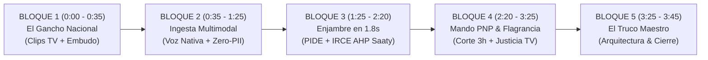

# 🎬 ESCALETA DE EDICIÓN PROFESIONAL: GUION TÉCNICO AUDIOVISUAL SARA
## Sistema Autónomo de Respuesta Anti-Extorsión (SARA) — All Things Agentic Hackathon

> 🌐 **Enlace Oficial de Producción en Google Cloud Run:** [https://sara-produccion-981735936523.us-central1.run.app/](https://sara-produccion-981735936523.us-central1.run.app/)  
> 🏆 **Categorías Objetivo:** **The Taskmaster** (Gran Premio) • **Best Multimodal UX** • **Best Architectural Design**  
> ⏱️ **Duración Total:** **3:40 a 3:45 minutos** | **Formato:** **1080p / 60fps** | **Audio:** **Voz en Off + Clips de TV + Efectos FX**

---

---

## 🎞️ GUION TÉCNICO DE MONTAJE Y EDICIÓN (SEGUNDO A SEGUNDO)

| Tiempo (Timecode) | 🎥 Pista Visual (Lo que se ve en pantalla) | 🎙️ Pista de Audio (Lo que se escucha) | 🏷️ Texto / Gráficos en Pantalla (Lower Thirds) |
| :--- | :--- | :--- | :--- |
| **0:00 - 0:08** *(8 seg)* | **Clip TV Noticia (Min 08:05 de Keiko):** Rostro/discurso en TV hablando de la extorsión a mototaxistas y comerciantes. | **Audio original del video TV:** *«...la extorsión que asfixia al pequeño comerciante, al mototaxista, al emprendedor...»* | 🔴 `CRISIS NACIONAL DE EXTORSION` *(Letras rojas de alerta)* |
| **0:08 - 0:17** *(9 seg)* | **Montaje Rápido (3 fotos):** 1. Titular de diario de extorsión a buses. 2. Nota extorsiva manuscrita con bala. 3. Gráfico del Embudo de Impunidad (350k denuncias $\rightarrow$ 9% Fiscalía). | **Tu Voz en Off (Tono firme y serio):** *«En el Perú se registran más de 350,000 denuncias al año, pero menos del 9% llega a la Fiscalía y el 80% de víctimas calla por miedo mortal a que filtren su identidad.»* | 📊 `350,000 DENUNCIAS EN COMISARÍAS` 📉 `MENOS DEL 9% LLEGA A FISCALÍA` |
| **0:17 - 0:25** *(8 seg)* | **Clip TV Noticia (Min 17:16 de Keiko):** El momento exacto donde anuncia la modernización tecnológica. | **Audio original del video TV:** *«...se requieren plataformas de inteligencia artificial para anticipar y mapear el delito, herramientas modernas de comunicación...»* | 💡 `URGENCIA: PLATAFORMAS DE IA` |
| **0:25 - 0:35** *(10 seg)* | **Transición de Impacto (Efecto Whoosh ⚡):** Corte limpio al Logo de SARA y portada principal de [http://localhost:8501](http://localhost:8501). | **Tu Voz en Off (Tono inspirador y enérgico):** *«Para responder a esa urgencia nacional, creamos SARA: un enjambre soberano multiagente en Google Cloud que transforma la denuncia en 1.8 segundos de investigación pericial.»* | 🛡️ **SARA** `Sovereign Autonomous Response for Anti-Extortion` `Powered by Google Cloud & Gemini 3.7` |
| **0:35 - 1:00** *(25 seg)* | **Grabación Pantalla SARA (Módulo 1):** Clic en *Portal Ciudadano*. Se muestra la selección de lengua originaria (Quechua / Awajún / Shipibo) o la interacción por voz. | **Tu Voz en Off:** *«Una víctima puede reportar en tiempo real en su lengua materna —como Quechua, Aimara, Awajún, Asháninka o Shipibo— con contención empática inmediata y escucha activa.»* | 🗣️ `INCLUSIÓN EN 5 LENGUAS ORIGINARIAS` 📜 `Ley N.° 29735 & ReNITLI (MINCUL)` |
| **1:00 - 1:25** *(25 seg)* | **Módulo 1 (Carga de Evidencia):** Carga de foto de nota extorsiva (`evidencia.jpg`) $\rightarrow$ Zoom-in a la generación del **Código CUP** de la víctima. | **Tu Voz en Off:** *«Cargamos una nota extorsiva y observen la magia de la privacidad: la Bóveda Zero-PII aísla el nombre y DNI real, emitiendo un Código Único de Protección (CUP). Los modelos de lenguaje jamás ven la identidad de la víctima.»* | 🔒 `ARQUITECTURA ZERO-PII` 🛡️ `Cloud KMS HSM FIPS 140-3 Nivel 3` 🔑 `CÓDIGO CUP GENERADO` |
| **1:25 - 1:50** *(25 seg)* | **Grabación Pantalla SARA (Módulo 3):** Clic en *Consola de Inteligencia Policial (PNP)*. Aparecen las tarjetas de los 17 agentes procesando en paralelo. | **Tu Voz en Off:** *«En apenas 1.8 segundos, el enjambre de 17 agentes entra en acción: el Forense Extractor aplica OCR multimodal con análisis ELA anti-manipulación y clasificación balística SUCAMEC...»* | ⚡ `PROCESAMIENTO ENJAMBRE: 1.8s` 🔬 `Vision OCR CoT + ELA + SUCAMEC` 🧠 `Gemini 3.7 Pro Reasoning` |
| **1:50 - 2:20** *(30 seg)* | **Módulo 3 (Cruce PIDE y Matriz de Riesgo):** Zoom a los resultados de RENIEC, OSIPTEL e INPE, y al velocímetro del índice IRCE ($T_{index} = 88.5$). | **Tu Voz en Off:** *«...el Agente PIDE cruza antecedentes con OSIPTEL, RENIEC y penales del INPE, mientras el Agente de Cálculo aplica el modelo matemático formal de AHP-Saaty calculando la criticidad letal de forma determinista y sin alucinaciones.»* | 🏛️ `INTEROPERABILIDAD PIDE (RENIEC / OSIPTEL / INPE)` 📐 `MODELO AHP-SAATY: T_index = 88.5/100` |
| **2:20 - 2:50** *(30 seg)* | **Módulo 3 (Medidas Tácticas):** Se marcan los checks de Bloqueo IMEI 3h y Congelamiento UIF 24h $\rightarrow$ Clic en *Firmar con Token CIP Policial*. | **Tu Voz en Off:** *«Bajo el principio Human-in-the-Loop, la IA no sanciona: asiste. El Comisario PNP valida las evidencias con sello RFC 3161 y hash SHA-256, ordenando el bloqueo de IMEI en menos de 3 horas bajo la Ley 32303 y el congelamiento bancario por la UIF.»* | 👮 `GOBERNANZA HUMAN-IN-THE-LOOP (HITL)` ⚡ `BLOQUEO IMEI EN 3 HORAS (Ley 32303)` 🏦 `CONGELAMIENTO UIF 24H (Ley 32209)` |
| **2:50 - 3:25** *(35 seg)* | **Módulo 3 & Módulo 4 (Flagrancia & FECOR):** Clic en *"Remitir Carpeta Fiscal a FECOR"* $\rightarrow$ Se muestra la notificación automática a Telegram y la Carpeta Fiscal digital. | **Tu Voz en Off (Impacto de Justicia TV y Flagrancia):** *«El propio Poder Judicial reportó en Justicia TV que sus Unidades de Flagrancia solo pudieron tramitar cerca de 200 casos por falta de fijación probatoria inmediata. Con SARA, entregamos a la Policía y al Juez de Flagrancia un expediente técnico sellado en 1.8 segundos, permitiendo que la justicia actúe en 48 horas sin impunidad.»* | 🏛️ `RESPALDO: JUSTICIA TV / PODER JUDICIAL` ⚡ `EXPEDIENTE PARA UNIDADES DE FLAGRANCIA` 📋 `EXPEDIENTE SIDPOL CERTIFICADO (D.Leg. 1735)` |
| **3:25 - 3:45** *(20 seg)* | **Módulo 8 (Arquitectura para Jueces / Vista Global):** Pantalla general con diagramas de Google Cloud, KPIs de ICE-IA (99.58%) y el enlace a Cloud Run. | **Tu Voz en Off (El Truco Maestro de Cierre):** **«Los invitamos a explorar nuestra plataforma en vivo desplegada en Google Cloud Run, donde podrán auditar en el Módulo 8 nuestra arquitectura jerárquica-paralela de 17 agentes, la telemetría MLOps bajo ISO 42001, y el Comité de Gobernanza de IA con el que protegemos la soberanía de los datos del Perú.»* | 🏆 **SARA: BIEN PÚBLICO DIGITAL SOBERANO** 🌐 `https://sara-produccion-...run.app` 🥇 `Google Cloud All Things Agentic Hackathon` |

---

## 💡 RESPALDO INSTITUCIONAL DE JUSTICIA TV (PODER JUDICIAL)

> *«El propio Poder Judicial acaba de reportar en Justicia TV que sus Unidades de Flagrancia tramitaron cerca de 200 casos de extorsión. Sin embargo, el embudo sigue siendo la falta de fijación probatoria inmediata.*
> 
> *Con SARA, entregamos a la Policía y al Juez de Flagrancia un expediente técnico sellado con hash SHA-256 y sello RFC 3161 en 1.8 segundos, permitiendo que las Unidades de Flagrancia multipliquen su capacidad de condenas sin que los extorsionadores queden libres por falta de pruebas.»*

---

## 💡 ARGUMENTO DEMOLEDOR PARA TU SUSTENTACIÓN ANTE EL JURADO (PNP / MININTER):

> **«SARA no inventó el concepto de reserva de identidad: SARA digitalizó y automatizó la Guía Oficial de la Policía Nacional del Perú (RCG N.° 1081-2025-CG-PNP) y la RM N.° 009-2025-IN. Reemplazamos el cuaderno manual de comisarías por una Bóveda Criptográfica Zero-PII bajo Google Cloud KMS, blindando al 80% de víctimas contra la filtración y cumpliendo con el Artículo 409-C del Código Penal en 0.05 milisegundos.»**

---

## 💡 FRASE RESUMEN PARA TU SUSTENTACIÓN (UNIFICACIÓN PNP ➔ FISCALÍA / FECOR):

> **«La Policía Nacional creó la Guía de Reserva de Identidad (RCG 1081-2025) y el Ministerio Público aprobó el Código Reservado en FECOR (Res. 098-2026-MP-FN). Ambas instituciones tenían la misma voluntad jurídica pero carecían del puente tecnológico.**
> 
> **SARA es ese puente: unifica el código policial y el código fiscal bajo el CÓDIGO ÚNICO DE PROTECCIÓN (CUP) mediante una Bóveda Zero-PII en Google Cloud KMS, logrando que la denuncia policial se convierta en investigación fiscal protegida en 1.8 segundos sin riesgo de infidencia ni impunidad.»**

---

## 🎛️ RECOMENDACIONES DE AUDIO Y EDICIÓN PROFESIONAL

1. **Música de Fondo (Backing Track):**
   * Elige una pista instrumental sutil, moderna y tecnológica (estilo *Cyberpunk / Tech Documentary / Cinematic Tension*).
   * **Volumen:** Mantén la música al **15% - 20%** cuando hables y súbela al **40%** en las transiciones de impacto (segundo 0:25 y segundo 3:25).
2. **Efectos de Sonido (SFX Clave):**
   * En el segundo **0:25** (cuando aparece el logo de SARA): Un efecto de sonido **"Whoosh / Impact Boom"**.
   * En el segundo **1:00** (cuando se genera el código CUP): Un sonido de **"Digital Chime / Lock Sound"** 🔒.
   * En el segundo **2:50** (cuando firmas con token CIP y remites a Fiscalía): Un sonido de **"Success Beep / Stamp"** 🏛️.
3. **Puntero del Ratón:**
   * En el editor de video (CapCut, Premiere, Clipchamp o DaVinci), haz un **zoom suave (115%)** hacia los botones que presionas para que el jurado no pierda de vista dónde haces clic.
