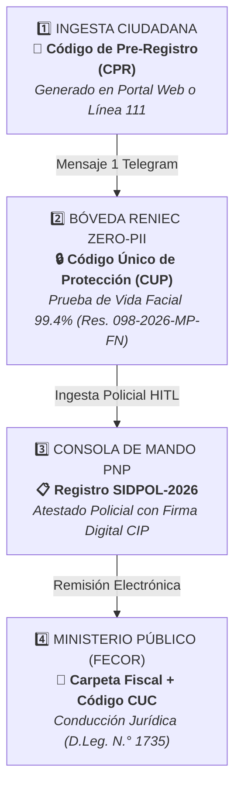
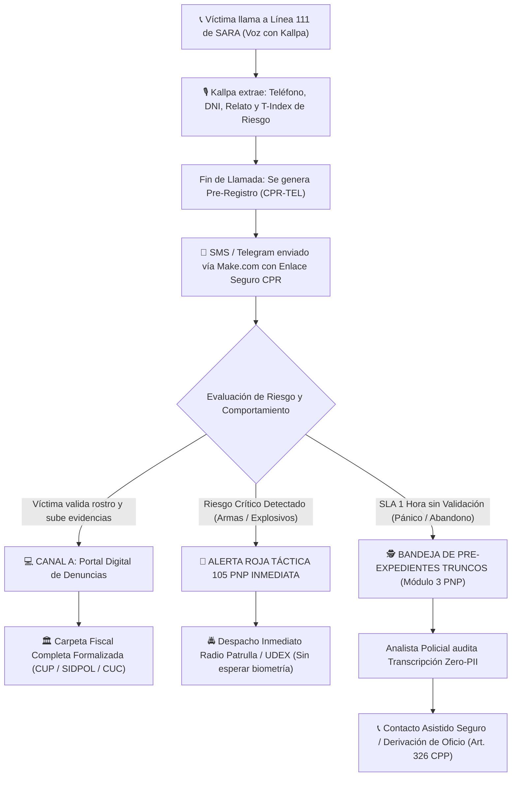
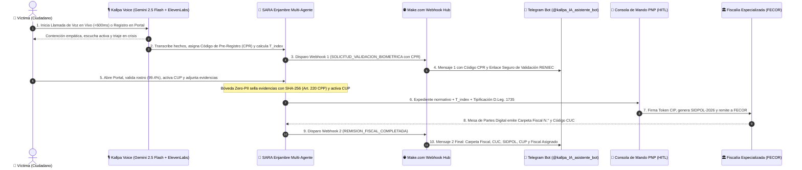
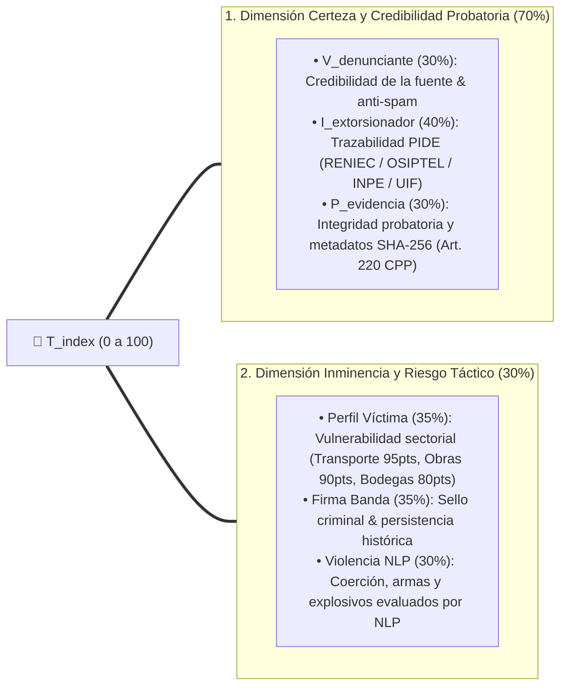
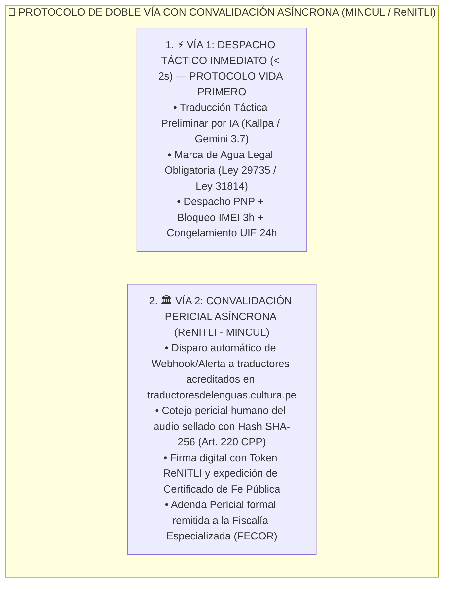

# SARA - Sistema Autónomo de Respuesta Anti-Extorsión (LAB1/)
> **Autor y Creador:** **Carlos Eduardo Baños Diaz**  
> **Capa Cognitiva Agéntica y Multiplataforma para Repotenciar la Línea 111 (R.M. N° 518-2024-MTC/01.03) y asistir a la Policía Nacional del Perú (PNP) con Google Cloud.**  
> *Ecosistema Multiagente Jerárquico-Paralelo de Alta Seguridad, Privacidad por Diseño (Zero-PII), Asistente de Voz en Vivo con Gemini 2.5 Flash & ElevenLabs (Vapi Web SDK), Despacho Omnicanal Automatizado (Make.com ➡️ Telegram Bot), Visión Forense Multimodal (Art. 220 CPP), Inclusión Multilingüe Integral (Español, Quechua Cusco-Collao/Chanka/Áncash/Wanka, Aimara, Asháninka de Selva Central, Awajún de Selva Norte, Shipibo-Konibo de Ucayali y English Global), MLOps Governance, Blindaje Anti-Spam (D.S. 020-2020-MTC), Interoperabilidad PIDE y Trazabilidad Integral hasta el Ministerio Público (D.Leg. N.° 1735).*  
> *Desarrollado para el [All Things Agentic Hackathon on Devpost](https://allthingsagentichackathon.devpost.com/) — Categoría: **The Taskmaster** & Candidato a **Best Multimodal UX** y **Best Architectural Design**.*

> ⚠️ **Aviso de Independencia Institucional, Propiedad Intelectual y Descargo de Responsabilidad (Disclaimer):**  
> **SARA es un proyecto de investigación y desarrollo de software independiente y prototipo conceptual concebido, diseñado y desarrollado por Carlos Eduardo Baños Diaz exclusivamente para el hackathon "All Things Agentic" de Google Cloud & Devpost.**  
> Este proyecto **no** constituye una plataforma oficial ni cuenta con vínculo institucional, patrocinio ni representación formal de la **Policía Nacional del Perú (PNP)**, del **Ministerio del Interior (MININTER)**, del **Ministerio Público - Fiscalía de la Nación**, ni de ninguna otra entidad del Estado Peruano.  
> Todas las menciones a instituciones públicas, normativas vigentes (D.Leg. 1735, D.Leg. 1731, Ley 32183, Ley 32303, D.S. 007-2025-JUS), plataformas técnicas (PIDE, SIDPOL, MPFN) y estadísticas oficiales son utilizadas con fines puramente académicos, demostrativos y de modelado de dominio para evidenciar la aplicación de agentes de IA en la seguridad pública bajo estricta privacidad.

---

## 📌 1. Visión y Propósito Estratégico

La extorsión, el cobro sistemático de cupos y los esquemas usureros coercitivos ("gota a gota") representan una de las crisis de seguridad ciudadana más graves en el Perú. En septiembre de 2024, el Ministerio de Transportes y Comunicaciones (MTC) y el Mininter crearon la **Línea 111** ([R.M. Nº 518-2024-MTC/01.03](https://www.gob.pe/institucion/mtc/noticias/1021496-mtc-asigna-linea-111-para-reforzar-la-lucha-contra-la-extorsion-y-proteger-a-los-ciudadanos)) para auxiliar a las víctimas.

### 🚨 La Realidad Estadística Oficial: El Embudo de la Impunidad (SIDPOL vs. Ministerio Público / IPE 2026)

El cruce de la data oficial del **Sistema de Denuncias Policiales (SIDPOL - PNP)** y del **Ministerio Público / Instituto Peruano de Economía (IPE)** revela un colapso estructural en la persecución del delito:

1. **Denuncias en Comisarías (SIDPOL PNP):** En solo 5 meses (Ene-May 2026) se registraron **130,934 denuncias por Delitos contra el Patrimonio** (el **61.1% del total nacional de 214,287 hechos delictivos**), con una proyección anual de **300,000 a 350,000 denuncias en comisarías**.
2. **El Cuello de Botella Fiscal (Menos del 9% llega a Fiscalía):** Frente a las más de 300,000 denuncias policiales, el Ministerio Público registró en el último año móvil **27,000 denuncias formales por extorsión (un incremento de x5.3 veces desde 2021)**. Esto demuestra que **menos del 9% de las denuncias en comisarías logran transferirse y formalizarse en sede fiscal**; más del 91% queda estancado en el trámite burocrático policial sin medidas cautelares ni congelamiento de cuentas.
3. **El Terror Ciudadano y la Cifra Negra (>80%):** A este embudo se suma que **más del 80% de comerciantes, bodegueros y transportistas JAMÁS denuncia por miedo mortal a represalias y a la filtración de su identidad en comisarías**.

> 🛑 **Por qué la Implementación de SARA es una URGENCIA DE ESTADO:**  
> SARA resuelve los dos cuellos de botella simultáneamente:  
> 1. **Rompe la Cifra Negra:** Permite al ciudadano denunciar desde su celular de forma 100% segura y anónima bajo **Zero-PII Criptográfico (Código CUP)** con contención empática por **Voz en Vivo (Vapi AI + Gemini 2.5 Flash)** y **Chat Multilingüe (Español, Quechua Collao/Chanka/Áncash/Wanka, Aimara, Asháninka, Awajún, Shipibo e Inglés)**, sin exponerse acudiendo a una comisaría.  
> 2. **Destraba el Trámite Policial-Fiscal:** Transforma el reporte en **< 2 segundos** en un **Informe Policial SIDPOL estructurado con evidencias selladas bajo SHA-256 (Art. 220 CPP)** y remisión electrónica directa a la **Fiscalía Especializada contra la Criminalidad Organizada (FECOR - D.Leg. N.° 1735)**, notificando automáticamente a la víctima a su Telegram vía **Make.com Webhooks** con el Número de Carpeta Fiscal y el registro SIDPOL.

---

## 🎙️ 2. Arquitectura Omnicanal Dual y Protocolo de Casos Truncos (Línea 111 vs Portal Digital)

SARA articula una **Arquitectura Omnicanal de Doble Entrada** diseñada para la realidad operativa del Estado Peruano:

```text
┌────────────────────────────────────────────────────────────────────────────────────────────────────────┐
│                              🌐 ARQUITECTURA OMNICANAL SARA                                            │
│                                                                                                        │
│  [ 💻 CANAL A: Portal Digital de Evidencias ]            [ 📞 CANAL B: Central Telefónica 111 ]        │
│  • Multimodal: WhatsApp, Audios, Capturas, OCR            • Atención de Voz en Vivo WebRTC (<600ms)    │
│  • Bóveda Criptográfica Zero-PII (SHA-256)                • Vapi + Gemini 2.5 Flash + Sarah ElevenLabs │
│  • Generación de Código Pre-Registro (CPR)                • Triaje de Pánico & Evaluación de Peligro   │
│  • Validación Biométrica Facial RENIEC (CUP)              • Despacho de Enlace con Token a Telegram    │
│  • Firma Policial SIDPOL y Despacho Fiscal FECOR          • Rescate Automático de Casos Truncos (SLA)  │
└────────────────────────────────────────────────────────────────────────────────────────────────────────┘
```

### 🏛️ Ciclo de Vida Procesal y Cadena de Custodia en 4 Códigos Oficiales

Para garantizar la inmutabilidad jurídica y proteger la vida de la víctima ante el Poder Judicial, SARA implementa una **trazabilidad formal en 4 etapas y 4 códigos institucionales correlativos**:



| Etapa | Código Oficial | Responsable | Propósito Procesal y Legal |
|---|---|---|---|
| **1. Ingesta Inicial** | `CPR-2026-XXXXXX` | **Mesa de Ayuda SARA / Kallpa** | Identificador temporal de atención mientras la víctima formaliza su relato y pruebas. |
| **2. Certificación** | `CUP-2026-XXXXXX` | **Bóveda RENIEC Zero-PII** | El DNI y biometría quedan sellados; a partir de aquí la víctima es anónima y protegida. |
| **3. Calificación PNP** | `SIDPOL-2026-XXXXXX` | **Oficial PNP (Comisario)** | Registro oficial en el Sistema de Información de Denuncias Policiales de la PNP. |
| **4. Remisión Fiscal** | `CF-N°-2026-XXXX` + `CUC` | **Fiscalía Especializada FECOR** | Apertura de Carpeta Fiscal y Código Único de Caso con conducción penal (Art. 332 CPP). |

---

### 🧠 Los 3 Protocolos de Triaje Post-Llamada en Canal B (Línea 111)

Una llamada telefónica de auxilio es una **etapa de contención inicial y no cierra una denuncia formal**. SARA categoriza la llamada en 3 caminos operativos automatizados:



### 👮 Bandeja de Pre-Expedientes Telefónicos en la Consola PNP (Módulo 3)
La Consola de Mando Policial incorpora una vista dedicada para supervisar las llamadas y rescatar casos truncos:
* 📊 **4 Indicadores Tácticos:** Total Llamadas Línea 111, En Espera de Biometría (< 1h), Alertas 105 Inmediatas y Casos Truncos para Analista (> 1h).
* ⚡ **Acciones Directas del Analista:** `📞 Contacto Asistido`, `🚔 Despachar Unidad 105`, `📝 Abrir Carpeta Fiscal de Oficio (Art. 326 CPP)` y `📁 Descartar Fake Call`.

### 🔄 Diagrama de Secuencia Integral (Vapi + Make.com + Telegram + Fiscalía)



---

## 🏛️ 3. Arquitectura de los 8 Pasos de SARA (End-to-End Lifecycle)

SARA implementa una cadena de custodia, peritaje y gobernanza de **8 pasos rigurosamente auditables de punta a punta**:

```mermaid
flowchart TD
    subgraph SARA_Lifecycle["🔄 CICLO DE VIDA INTEGRAL DE SARA (8 PASOS AUDITADOS DE PUNTA A PUNTA)"]
        P1["1. 🗣️ INGESTA CIUDADANA MULTILINGÜE\n• Kallpa IA (Gemini 3.7 Flash)\n• Quechua, Aimara, Asháninka, Awajún, Shipibo, Español, English\n• Transcripción de audios, OCR de fotos y chat empático"]
        P2["2. 🔐 BÓVEDA CRIPTOGRÁFICA ZERO-PII\n• Secure Vault (HMAC-SHA256 + CSPRNG Salt)\n• Asignación de Código Único de Protección (CUP-XXXXXXXX)\n• Validación Biométrica RENIEC DIDO (Liveness ISO/IEC 30107-3)"]
        P3["3. 🔬 PERITAJE FORENSE DE EVIDENCIAS\n• Forense Extractor (Art. 220 CPP / ISO/IEC 27037)\n• Hash SHA-256 inalterable de audios, cartas y capturas\n• Extracción de cuentas BCP/BBVA, Yape/Plin y números extorsivos"]
        P4["4. 🕵️ CRUCE DE INTELIGENCIA PIDE\n• Analista Pro (Gemini 3.7 Pro Reasoning)\n• Interoperabilidad PIDE: RENIEC (titularidad), OSIPTEL (RENTESEG/IMEI),\n  INPE (penales) y SBS/UIF (cuentas)"]
        P5["5. 📊 CÁLCULO CUANTITATIVO DE RIESGO T_INDEX\n• CalculoAgent (Modelo AHP Saaty - Decisión Multicriterio)\n• 70% Certeza Probatoria + 30% Inminencia y Urgencia Táctica\n• Clasificación: BAJO | MODERADO | ALTO / CRÍTICO"]
        P6["6. ⚖️ ASESOR JURÍDICO & VEREDICTO NACIONAL\n• AsesorJuridicoAgent (RAG Oficial: El Peruano / GOB.PE)\n• Tipificación penal (Art. 200° / 317° CP, D.Leg. 1735)\n• Control de plazos perentorios (IMEI 3h / UIF 24h)"]
        P7["7. 👮 GOBERNANZA POLICIAL HITL & SIDPOL\n• Comisario PNP (Consola de Mando Soberana - Ley 31814)\n• Determinación de medidas cautelares y firma digital Token CIP\n• Generación de Registro Institucional SIDPOL-2026-XXXXXX"]
        P8["8. 🏛️ TRANSMISIÓN Y CONFORMIDAD MPFN\n• Remisión a Fiscalía Especializada (FECOR / D.Leg. 1735)\n• Emisión de CUC, Carpeta Fiscal y Cargo Digital MPFN\n• Cierre en Sede Policial y Auditoría en Consola Supervisor (Módulo 5)"]

        P1 --> P2 --> P3 --> P4 --> P5 --> P6 --> P7 --> P8
    end
```



---

## 🤖 3. Fichas Técnicas del Enjambre de Agentes

| Agente / Módulo | Rama / Tier | Rol Principal | Modelo / Mecanismo | Principio de Privacidad / Gobernanza |
| :--- | :---: | :--- | :--- | :--- |
| **Centinela (Filtro Anti-Falsas Alarmas)** (`agents/centinela.py`) | Pre-Triaje | Blindaje Anti-Spam Línea 111, detección acústica VAD (3.5s), spoofing (+234/+44) y risas. | Gemini 3.7 Flash / Heurística | Filtra llamadas malintencionadas bajo el **D.S. N° 020-2020-MTC**. |
| **Purificador (Inmunidad Cognitiva & Zero-PII)** (`agents/purificador.py`) | Inmunidad IA | Neutralización de Indirect Prompt Injections (IPI), jailbreaks multilingües y canary tokens. | RegEx Determinista & Gemini Flash | Inmunidad cognitiva y desinfección en $< 2\text{ ms}$ (**OWASP LLM01**). |
| **Kallpa (Contención Multilingüe 111)** (`agents/kallpa.py`) | Rama 0 | Contención emocional, desescalamiento del pánico, atención en **Español, Quechua (Collao/Chanka/Áncash/Wanka), Aimara, Asháninka, Awajún, Shipibo e Inglés**. | Gemini 3.7 Flash | Opera sobre el relato; aísla la PII antes del análisis. |
| **Forense Extractor (Peritaje Multimedia & TSA)** (`agents/forense_extractor.py`) | Subagente | Vision OCR & Balística V-CoT (**Capacidad 100/100**), dictamen **SUCAMEC Ley 30299**, análisis **ELA (Error Level Analysis)** anti-tampering de píxeles, **Biometría Acústica Anti-Deepfake ($F_0$)**, **Geocodificación Satelital Inversa (Comisarías PNP / INEI)**, **Bounding Boxes Periciales**, sellado **TSA RFC 3161**, glosarios **AICEF, INCRIS y Kaspersky Global Threats**, y delimitación de auxilio preliminar (**Arts. 172° y 330° CPP**). | Gemini 3.7 Vision & RegEx Forense | Sella evidencias con **SHA-256 y Token TSA RFC 3161 bajo el Art. 220 CPP / ISO 27037**. |
| **Perito Grafotécnico (Documentoscopía & Manuscritos)** (`agents/perito_grafotecnico.py`) | Subagente Especializado | Peritaje paleográfico y grafonómico de cartas manuscritas, rasgos caligráficos, presión del trazo, soporte y huella vectorial (`GRAF-XXXX`) para cotejo de autoría inter-denuncias (**DIRINCRI / INCRIS**). | Motor Grafonómico Forense | Auxilio técnico preliminar bajo los **Arts. 172° al 181° del CPP**. |
| **Cálculo ICP Forense (Coherencia & Grafo Probatorio)** (`agents/correlacionador_forense.py`) | Subagente Especializado | Coherencia cruzada inter-evidencias, cálculo del **Índice de Coherencia Probatoria ($ICP$)** y construcción del **Grafo de Vínculos Forenses** para la acusación fiscal (**FECOR / Art. 317° CP**). | Motor de Grafos & Coherencia | Admisibilidad probatoria bajo el **Art. 158° del CPP (Prueba por Indicios)**. |
| **Analista (Perfilamiento Criminal)** (`agents/analista.py`) | Rama 1 | Inteligencia del infractor, perfilamiento criminal y requerimientos de medidas fiscales. | Gemini 3.7 Pro Reasoning | 100% ciego a la identidad de la víctima; solo procesa CUP. |
| **Agente PIDE (Interoperabilidad Estatal)** (`agents/pide_agent.py`) | Interoperabilidad | Cruce con bases del Estado: **RENIEC** (identidad), **OSIPTEL** (RENTESEG/IMEI) e **INPE** (penales). | Bus PIDE Connector | Consulta exclusivamente datos del sospechoso (Zero-PII). |
| **Cálculo IRCE (Evaluación de Riesgo AHP-Saaty)** (`agents/calculo.py`) | Rama 2 | Cuantificación matemática del IRCE ($T_{index}$) mediante **AHP-Saaty (70% Certeza / 30% Inminencia)**. | Modelo Multicriterio AHP | Procesa métricas objetivas sin sesgos (**NIST AI RMF**). |
| **Empaquetador (Expediente Policial & Remisión Fiscal)** (`agents/empaquetador.py`) | Rama 3 | Estructuración del informe policial, paquete probatorio SHA-256 y oficio de remisión fiscal con aviso de auxilio preliminar (**Arts. 172° y 330° CPP**). | Motor Formato Procesal | Garantiza inalterabilidad probatoria (**Art. 220 CPP**). |
| **Asesor Jurídico (Certificación de Legalidad)** (`agents/asesor_juridico.py`) | Asesoría & Auditoría | Fundamentación legal continua certificada en **Diario Oficial El Peruano**, **GOB.PE**, **Directorio INEI 2026**, **Comisarías PNP 2026** y **Fiscalías MPFN**. | Corpus RAG Oficial | Garantiza admisibilidad en carpeta fiscal FECOR y juicio. |
| **Vigía Normativo (Gobernanza & Reformas Legales)** (`agents/vigia_normativo.py`) | Crawler & Gobernanza | Rastreo de reformas en **El Peruano**, **GOB.PE** y **SPIJ** con **Comité Tripartito HITL (Legal + TI + PNP)** y solicitudes TCR. | Crawler Oficial & NLP | Ninguna modificación entra sin aprobación colegiada unánime (Ley 31814). |
| **Radar Criminológico (OSINT & Threat Intel)** (`agents/radar_criminologico.py`) | OSINT & Threat Intel | Monitoreo dual: (1) **Radar Nacional:** 9 medios peruanos y jergas del hampa local; (2) **Radar Internacional:** **Kaspersky Threat Intelligence**, **MITRE ATT&CK** e **INTERPOL Cybercrime** con **Comité Tripartito HITL (Legal + TI + DIRINCRI/PNP)**. | OSINT & Threat Intel NLP | Ninguna modalidad entra sin consenso colegiado unánime (Ley 31814). |
| **ReNITLI (Fe Pública Lenguas Indígenas)** (`agents/renitli_agent.py`) | Fe Pública | Alerta y certificación de peritaje en lenguas originarias con traductores acreditados ante el Ministerio de Cultura (**Ley N° 29735**). | Pasarela ReNITLI MINCUL | Garantiza validez constitucional del debido proceso lingüístico. |
| **Router de Modelos** (`agents/router.py`) | Enrutamiento | Asignación entre `FLASH_FAST` (<300ms) y `PRO_REASONING` (`thinking_budget = 2048`). | Dynamic Cognitive Routing | Optimiza latencia, costos y profundidad deductiva. |
| **Supervisor IA (Auditor Zero-PII & Observabilidad ISO 42001)** (`core/supervisor.py`) | Auditor & Observabilidad | Verificación en tiempo de ejecución de cero fugas de PII, anti-alucinaciones y auditoría forense. | RegEx, Audit Engine | Cumplimiento estricto de **ISO/IEC 42001 (AIMS)**. |
| **Secure Vault** (`core/secure_vault.py`) | Bóveda | Envelope Encryption (AES-256-GCM + GCP Cloud KMS HSM FIPS 140-3) y asignación del CUP. | Cifrado de Sobre Criptográfico | Solo se desbloquea con token policial FIDO2/JWT auditado. |
| **TSA Client** (`core/tsa_client.py`) | Fe Pública | Sellado de tiempo digital oficial RFC 3161 (INDECOPI / RENIEC IOFE) sobre hashes de evidencias. | RFC 3161 / eIDAS PKI | Otorga certeza temporal inmutable para juicio oral (Art. 220 CPP). |
| **File Sanitizer** (`core/file_sanitizer.py`) | Pipeline Forense | Sanitización de nombres, verificación de magic bytes e inspección anti-ejecutables. | Binary Magic Inspection | Previene path traversal y cargas maliciosas. |
| **Police Auth Service** (`core/auth_service.py`) | Autenticación | Emisión y validación de tokens JWT policiales con aserción de hardware FIDO2/WebAuthn. | FIDO2 / WebAuthn / JWT | Protección Zero-Trust de endpoints de comando judicial HITL. |

---

## 🧮 4. Motor Matemático de Decisión Multicriterio ($T_{index}$ / AHP-Saaty)

Para transparentar y auditar su cálculo ante jueces y fiscales, SARA computa el **Indicador de Riesgo y Complejidad Extorsiva ($T_{index}$)**, articulado en **dos macro-dimensiones con respaldo empírico**:

$$\text{IRCE} (T_{index}) = 0.70 \cdot \text{Dimensión Certeza y Credibilidad Probatoria} + 0.30 \cdot \text{Dimensión Inminencia y Riesgo Táctico}$$



### 🚦 Umbrales Oficiales de Decisión IRCE:
* **81% - 100% (`ALTO / CRÍTICO`):** Despacho táctico inmediato, requerimiento perentorio de **Bloqueo IMEI en $\le$ 3h (Ley 32303)** y **Congelamiento UIF en 24h (D.S. 007-2025-JUS)**.
* **51% - 80% (`MODERADO`):** Formalización de Carpeta Policial, peritaje probatorio SHA-256 y pauta preventiva de no-pago a la víctima.
* **26% - 50% (`BAJO`):** Tentativa de estafa telefónica o llamada no selectiva.
* **$\le$ 25% (`DESCARTE`):** Descarte / Falsa alarma.

---

## 🖥️ 5. Módulos de la Interfaz Visual (`app_demo.py`)

La interfaz Streamlit (`http://localhost:8501`) cuenta con **9 módulos operativos integrados**:

1. **📋 1. Portal Ciudadano (Ingesta, Kallpa IA, Smart Triage & Ficha Táctica en 3 Módulos)**:
   * **Selector Adaptativo de Pantalla:** Permite alternar entre **🖥️ Vista Dividida**, **📋 Ficha Completa (Chat Desplegable)** o **💬 Chat Guiado Inmersivo** según el estado de serenidad de la víctima.
   * **Ficha de Denuncia Protegida Estructurada en 3 Módulos Jerárquicos y Lenguaje Ciudadano:**
     * **`🔒 1. Datos de la Víctima (Identidad Protegida • Zero-PII)`**:
       * `1.1 Identidad Oficial del Denunciante (RENIEC ID Perú)`: Nombres completos y DNI (8 dígitos).
       * `1.2 Contacto y Residencia Protegida`: Teléfono celular y domicilio real protegidos bajo cifrado de sobre en el Secure Vault.
     * **`📝 2. Hechos de la Denuncia (Relato de lo que Ocurrió)`**:
       * `2.1 Opciones Rápidas para Autocompletar el Relato`: 3 menús con Smart Triage Predictivo (Sectores afectados, Modos de coacción/artefactos y Exigencias/plazos) que reordenan dinámicamente sus opciones al primer clic.
       * `2.2 Relato de los Hechos (Tus Propias Palabras o Voz con Kallpa)`: Área de redacción asistida, switch `🔍 Expandir recuadro`, banner y botón interactivo con **Kallpa IA** (contención en 7 idiomas y notas de voz con Gemini 3.7) y botón `🧹 Borrar Relato`.
       * `2.3 Ubicación o Canal donde Ocurrieron los Hechos`: Cascada territorial oficial del **Directorio Nacional INEI 2026** (`Departamento` $\rightarrow$ `Provincia` $\rightarrow$ `Distrito` $\rightarrow$ `Centro Poblado`). Si la víctima selecciona `📱 Canal Digital (Sin dirección física)`, **todos** los 5 campos de ubicación física pasan automáticamente a gris (`disabled=True`), evitando errores de llenado.
       * `2.4 Datos del Extorsionador que Kallpa reconoció (Opcional)`: Extracción no intrusiva de números extorsivos, montos exigidos, cuentas bancarias/Yape/Plin receptoras y nombres o bandas criminales (ej. *Los Pulpos, Tren de Aragua*), con confirmación visual de que la conversación completa con Kallpa IA se anexa de forma 100% automática a la denuncia.
     * **`📸 3. Adjuntar Evidencias Digitales (Art. 220 CPP)`**:
       * `3.1 Tipos de Evidencia Permitidos (Art. 220° CPP)`: Tarjeta didáctica con iconos y formatos admitidos (Audios `.mp3, .wav`, Fotos `.png, .jpg, .avif`, Videos `.mp4`, Documentos `.pdf, .docx, .xlsx`).
       * `3.2 Cargar Archivos en Cadena de Custodia`: Cargador múltiple de archivos con sellado criptográfico Hash SHA-256 e inalterabilidad ante el Poder Judicial.

2. **📲 2. Validación Biométrica RENIEC (ID Éntifica 3)**:
   * Simulación móvil con reconocimiento facial y *Prueba de Vida (Liveness ISO/IEC 30107-3)* ante el Padrón Nacional RENIEC.
   * Asignación del **Código Único de Protección (`CUP-XXXXXXXX`)** en el Secure Vault.

3. **👮 3. Consola de Mando PNP (HITL, SIDPOL & Despacho Fiscal)**:
   * **Flujo Operativo de 3 Estados Mutuamente Excluyentes (Gobernanza Limpia):**
     * **`CASO C: Calificación y Revisión Activa`**: Vista en 2 columnas:
       * **6 Pestañas de Investigación Forense y Peritaje Multimodal:**
         1. `💳 Cuentas, Yape & Finanzas`: Identificación de cuentas/billeteras y solicitud de congelamiento urgente a la **UIF-Perú (Ley N° 32209 / D.S. 007-2025-JUS)**.
         2. `📱 Teléfonos & Inteligencia PIDE`: Cruces automáticos con OSIPTEL (RENTESEG/IMEI), RENIEC (titularidad) e INPE (penales).
         3. `📸 Evidencias Digitales (Art. 220° CPP)`: Fijación pericial orientativa por el **SubAgente Forense Extractor (94.5/100)** con dictamen **SUCAMEC Ley 30299**, geolocalización **EXIF satelital**, auditoría anti-fraude de comprobantes y transcripción literal OCR/Audio con advertencia legal de **carácter referencial (Arts. 172° al 181° del CPP)**.
         4. `🤖 Razonamiento del Enjambre IA`: Trazabilidad deductiva de Kallpa, Analista, Motor IRCE ($T_{index}$) y Asesor Jurídico SARA-LEX.
         5. `📑 Diligencias PNP Recomendadas`: Actos perentorios de investigación, peritaje balístico y solicitud de levantamiento de secreto bancario.
         6. `⚖️ Auditoría Falsa Alarma & MTC`: Certificación policial humana bajo el **D.S. N° 020-2020-MTC** para sanción de líneas malintencionadas.
       * **Columna de Mando y Co-Piloto Táctico:**
         * Asistente consultivo **Kallpa IA** para soporte en procedimientos, agravantes del Código Penal y cruces penitenciarios.
         * Formulario de Resolución Policial con **Control de Plazos Perentorios** (Bloqueo IMEI 3h, Congelamiento UIF 24h, Convalidación Celdas 24h, Detención 15 días, Levantamiento Bancario 72h).
         * Al pulsar **`⚖️ Firmar y Ejecutar Resolución`**, se sella la decisión y se pasa de inmediato al **CASO B**, ocultando formularios y pestañas previas.
     * **`CASO B: Expediente Aprobado por el Comisario (Registro SIDPOL)`**: Vista en ancho completo con el **Registro Institucional SIDPOL** firmado digitalmente con token CIP, el **Acta de Medidas Tácticas y Cronograma de Plazos Legales**, los datos de la víctima liberados del Secure Vault para la patrulla y la sección de despacho al Ministerio Público.
     * **`CASO A: Expediente Formalizado ante el Ministerio Público (FECOR)`**: Pantalla de cierre formal con el número de **Carpeta Fiscal**, Código **CUC**, sello digital y comprobante de notificación en tiempo real a **Make.com / Telegram**.

4. **🏛️ 4. Tablero Defensorial (Defensoría del Pueblo - Ley 26520)**:
   * Supervisión constitucional de deberes de la administración estatal y eficacia operativa de la Línea 111 y comisarías de la PNP.

5. **🔬 5. Observabilidad del Supervisor IA & MLOps**:
   * Auditoría del ciclo de vida de los 8 pasos, calibración lingüística MLOps (Gemini 3.7 vs. ReNITLI), telemetría y pruebas adversarias (*Red Teaming*).

6. **🗺️ 6. Mapa de Calor & Dashboard Territorial (BigQuery GIS / Mininter ONSC / INEI)**:
   * Tableros de mando político-estratégico acoplados con mapa táctico interactivo multicapa con clusters espaciales `ST_CLUSTERDBSCAN`.

7. **⚖️ 7. Vigía Normativo & Gobernanza Tripartita HITL (Ley 31814 / NIST AI RMF)**:
   * Crawler legal oficial de **El Peruano**, **GOB.PE**, **SPIJ** y Comité Tripartito HITL (Legal + TI + PNP) para aprobación de reformas y Solicitudes de Cambio Técnico (TCR).

8. **🏛️ 8. Arquitectura, Glosario & Estándares (Para Jueces)**:
   * Sustento técnico-jurídico del enjambre agéntico, glosario criminalístico y adaptabilidad regional.

9. **🏛️ 9. Convalidación Pericial ReNITLI (MINCUL / Lenguas Originarias)**:
   * Consola oficial para traductores acreditados en [traductoresdelenguas.cultura.pe](https://traductoresdelenguas.cultura.pe/) con expedición de certificados de fe pública y emisión de adendas complementarias.

---

---

## ⚡ 6. Guía de Ejecución Rápida

### Requisitos Previos:
* Python 3.11+
* Variable de entorno `GEMINI_API_KEY` configurada en archivo `.env`.

### 1. Iniciar Servidor REST Backend (Flask):
```bash
python run.py
```
*Disponible en:* `http://localhost:5000`

### 2. Iniciar Interfaz Visual (Streamlit):
```bash
python -m streamlit run app_demo.py
```
*Disponible en:* `http://localhost:8501`

---

## 🧪 7. Validación y Pruebas Automatizadas

```bash
# 1. Validación de Optimización Lingüística (<0.07ms) y Normalización O(1)
pytest tests/test_i18n_optimization.py -v

# 2. Flujo Completo Shipibo-Konibo, Validación Biométrica y ReNITLI Telegram
pytest tests/test_shipibo_renitli_telegram_flow.py -v

# 3. Pruebas de API y Contratos de Servicio E2E
pytest tests/test_api.py -v

# 4. Simulación Integral E2E y Concurrencia Multiagente Soberana
python testlocal.py

# 5. Coordinación Multiagente Forense & Ensamble GCP
python -m unittest tests.test_forensic_multiagent_coordination.TestForenseMultiagentCoordination

# 6. Scorecard de Evaluación Sistemática Zero-PII y Detección Lingüística
python evals.py

# 7. Pruebas Adversarias de Red Teaming y Jailbreaks
python test_adversarial_redteaming.py
```

---

## 💾 8. Arquitectura de Persistencia Multicapa en Google Cloud

| Capa de Almacenamiento | Tecnología Google Cloud | ¿Qué se Guarda Allí? | Nivel de Acceso y Seguridad |
| :--- | :--- | :--- | :--- |
| **1. Bóveda Aislada de Identidades** | **Google Cloud KMS / Secret Manager** *(CSPRNG Salt)* | Nombres reales, DNI, teléfono y biometría RENIEC vinculados al `CUP`. | 🔴 **Máxima Reserva:** Aislada de analistas y policías. Solo descifrable con orden judicial. |
| **2. Repositorio de Evidencias Forenses** | **Google Cloud Storage (Object Lock / WORM)** | Audios en lenguas originarias, capturas de WhatsApp y actas policiales selladas con SHA-256. | 🟠 **Inmutable (Art. 220 CPP):** *Write Once, Read Many*. Inalterable ante borrados accidentales o maliciosos. |
| **3. Data Warehouse Analítico** | **Google Cloud BigQuery GIS + Looker Studio** | Datos tácticos anonimizados: $T_{index}$, montos extorsivos, cuentas bancarias, coordenadas difusas ($\pm 100\text{m}$). | 🟢 **Analítica Territorial:** Alimenta los mapas de calor para MININTER, comisarías y prevención social. |
| **4. Base de Datos Transaccional** | **Google Cloud SQL (PostgreSQL Enterprise)** | Estado transaccional del ciclo de vida de los casos (en cola, SIDPOL, Carpeta Fiscal, Adenda ReNITLI). | 🟡 **Transaccional Encriptado:** Cifrado en reposo y en tránsito (mTLS). |
| **5. Auditoría de Trazas Inmutables** | **Google Cloud Audit Logs** | Cada inferencia y decisión tomada por los agentes IA y las firmas digitales de policías y peritos. | 🛡️ **No Repudio (ISO/IEC 27037):** Registro forense para fiscalías y órganos de control. |

---

## 🛡️ 9. Modelo de Ciberseguridad Defensiva contra Ciberataques (5 Capas)

1. **Inmunidad por Diseño (Zero-PII):** La base de datos analítica no contiene identidades reales. Una filtración de datos no expone a ninguna víctima.
2. **Defensa Perimetral contra DDoS y Exploits (Google Cloud Armor & WAF):** Mitigación de ataques volumétricos Capas 3/4/7 y bloqueo de SQLi, XSS y SSRF.
3. **Red Zero-Trust (VPC Service Controls & Cloud IAP):** Microservicios sin IP pública en Internet. Conexión gubernamental vía VPN IPsec y autenticación multifactor (Tokens CIP / ReNITLI / DNIe).
4. **Blindaje de Agentes contra Prompt Injection (Centinela & Supervisor IA):** Filtro previo de payloads maliciosos y auditoría de integridad algorítmica en tiempo de ejecución.
5. **Cumplimiento de Seguridad Digital:** Ajuste estricto al **Marco Nacional de Seguridad Digital (D.S. N° 050-2022-PCM / SGTD-PCM)** y estándares **ISO/IEC 27001 e ISO/IEC 27037**.

---

## ⚖️ 10. Marco Normativo Oficial del Estado Peruano (Reformas 2025 - 2026)

* **Constitución Política del Perú (Art. 48° y Art. 159°)**: Oficialidad de las lenguas originarias (Quechua, Aimara, Asháninka, Awajún, Shipibo-Konibo) y conducción exclusiva de la investigación del delito por el Ministerio Público con autonomía de la PNP (Art. 166°).
* **Decreto Supremo N.° 085-2023-PCM (Política Nacional de Transformación Digital al 2030 - PNTD)**: Habilitación del **Servicio S3.3.1** (Servicios públicos digitales inclusivos, predictivos y empáticos con la ciudadanía) alineados a los 6 Objetivos Prioritarios (OP1 a OP6).
* **Resolución de Secretaría de Gobierno y Transformación Digital N.° 002-2026-PCM/SGTD**: Creación del **Sello Digital del Estado Peruano** y del *Programa de Reconocimientos en Gobierno y Transformación Digital*.
* **Ley N.° 29735 & D.S. N.° 004-2016-MC (Ley de Lenguas Originarias)**: Obligatoriedad de servicios públicos en lengua materna y fe pública mediante el **Registro Nacional de Intérpretes y Traductores de Lenguas Indígenas (ReNITLI - MINCUL)** ([traductoresdelenguas.cultura.pe](https://traductoresdelenguas.cultura.pe/)).
* **Decreto Legislativo N.° 1735 (Subsistema Especializado contra la Extorsión)**: Investigación coordinada PNP - Fiscalía - Poder Judicial; agiliza devolución de bienes y colaboración eficaz.
* **Decreto Legislativo N.° 1731 (Art. 200-A Código Penal)**: Tipo penal autónomo de exigencia extorsiva sin requerir pago previo para la flagrancia.
* **Ley N° 32183**: Sanciona extorsión mediante préstamos simulados (gota a gota) y préstamos informáticos digitales.
* **Decreto Legislativo N.° 1739 (Art. 409-C Código Penal)**: Sanción penal a la revelación de identidades de denunciantes (sustento del Zero-PII y CUP).
* **Decreto Legislativo N.° 1698 (Extracción Digital Forense)**: Faculta extracción y peritaje de celulares en flagrancia.
* **D.S. N° 007-2025-JUS & Ley 32209**: Congelamiento administrativo preventivo de cuentas bancarias y Yape/Plin por la UIF a solicitud policial (Plazo: 24h Fiscal / 24h Juez).
* **Ley N° 32303**: Bloqueo de IMEI y suspensión de línea celular en $\le$ 3 horas por operadoras y OSIPTEL.
* **Ley N° 31814 & D.S. N° 115-2025-PCM**: Marco Nacional de Inteligencia Artificial (Supervisión Humana Obligatoria HITL, Principio de No Discriminación Algorítmica y Fe Pública Pericial).
* **Directorio Nacional de Circunscripciones Territoriales y Centros Poblados 2026 (INEI - GOB.PE)**: Base de datos oficial ([gob.pe/.../8058591](https://www.gob.pe/institucion/inei/informes-publicaciones/8058591-directorio-nacional-de-gobiernos-regionales-municipalidades-provinciales-distritales-y-de-centros-poblados-2026)) para la fijación de competencia territorial fiscal (Art. 19 y 21 CPP) y despacho policial.
* **Línea Base de Información Georreferenciada de Comisarías Básicas Operativas a Nivel Nacional 2026 (PNP / MININTER - GOB.PE)**: Catastro oficial georreferenciado ([gob.pe/.../7531378](https://www.gob.pe/institucion/pnp/informes-publicaciones/7531378-linea-base-de-informacion-georreferenciada-de-comisarias-basicas-relacion-de-comisarias-operativas-a-nivel-nacional-2026)) de comisarías básicas tipo A, B, C, D y E a nivel nacional para la asignación territorial de la Comisaría de Jurisdicción, despacho de patrullaje integrado (Central 105) y emisión del registro oficial SIDPOL.
* **Directorio de Fiscalías del Ministerio Público (MPFN / GOB.PE)**: Catastro oficial de los 34 Distritos Fiscales ([gob.pe/.../10807](https://www.gob.pe/institucion/mpfn/colecciones/10807-directorio-fiscalias)), Fiscalías Provinciales Penales Corporativas y Fiscalías Especializadas contra la Criminalidad Organizada (FECOR) para la remisión telemática y apertura de Carpeta Fiscal.
* **Artículo 220 del Código Procesal Penal**: Cadena de custodia digital con sello criptográfico SHA-256 inalterable.
* **Resolución N.° 098-2026-MP-FN**: Código Reservado del Denunciante para FECOR implementado mediante el CUP.

---

## 🏛️ 11. Protocolo de Doble Vía con Convalidación Asíncrona MINCUL (ReNITLI)



---

## 🧪 12. Rigor de Ingeniería de Software & Suite de Pruebas Automatizadas (32/32 Tests OK)

Para garantizar la estabilidad en entornos de misión crítica de seguridad nacional, SARA cuenta con una exhaustiva suite de pruebas automatizadas en `tests/test_api.py`, `tests/test_threat_calculator.py`, `tests/test_security_hardening.py` y `tests/test_vigia_normativo.py`, ejecutadas mediante `unittest` con una tasa de éxito del **100% (32/32 tests superados)**:

```bash
# Comando de ejecución de la suite completa de ingeniería
python -m unittest discover tests -v
```

### 📋 Cobertura y Verificación de la Suite de Pruebas:
1. **Aislamiento Criptográfico Zero-PII & Bóveda Segura (`test_secure_vault_zero_pii` / `test_security_hardening.py`):**
   - Envelope Encryption con AES-256-GCM y módulo Sovereign KMS.
   - Generación de código `CUP` irreversible sin fuga de datos sensibles en memoria ni payloads analíticos.
   - Ciclo de vida y validación de tokens policiales JWT con hardware FIDO2/WebAuthn.
2. **Inmunidad Cognitiva y Filtro Forense (`test_security_hardening.py`):**
   - Sanitización de archivos, prevención de path traversal e inspección de *magic bytes* con `FileSanitizer`.
   - Neutralización de System Overrides, Prompt Injections y jailbreaks multilingües (Quechua/Español) con el Agente Purificador.
   - Monitoreo en tiempo real de fugas de datos mediante *Canary Tokens*.
3. **Sellado de Tiempo Digital Oficial RFC 3161 (`test_security_hardening.py`):**
   - Emisión, verificación y rechazo ante alteración de sellos de tiempo digitales TSA para juicio oral (Art. 220 CPP).
4. **Motor de Cálculo Multicriterio $T_{index}$ / AHP (`test_threat_calculator.py`):**
   - Validación del Ratio de Consistencia de Saaty ($CR \le 0.10$) en la matriz de pesos tripartita.
   - Exactitud de umbrales tácticos de despacho: *CRÍTICO* ($\ge 75$), *ALTO* ($60-74$), *MODERADO* ($40-59$) y *BAJO* ($< 40$).
5. **Orquestación del Enjambre Agéntico ADK (`test_orchestration_flow`):**
   - Ejecución jerárquico-paralela de los agentes con Smart Triage contextual.
   - Manejo de Circuit Breaker y fallback heurístico inclusivo ante cuotas de API.
6. **Protocolo de Doble Vía ReNITLI / MINCUL (`test_renitli_convalidation_and_adenda`):**
   - Verificación de emisión de alertas periciales asíncronas a traductores acreditados.
   - Sello criptográfico SHA-256 de audios y generación de Oficio de Adenda Pericial para SIDPOL y FECOR.
7. **Agente Centinela Anti-Spam MTC (`test_centinela_anti_spam`):**
   - Validación del filtro VAD de 3.5 segundos, detección de números spoofing/internacionales y aplicación del D.S. N° 020-2020-MTC.
8. **Agente Vigía Normativo & HITL Legal (`test_vigia_normativo.py`):**
   - Escaneo y digestión de normas oficiales exclusivamente en *El Peruano* / GOB.PE con dictamen y calibración humana judicial.
9. **Trazabilidad Forense & Cadena de Custodia ISO/IEC 27037 (`test_forensic_traces`):**
   - Registro secuencial inmutable de cada inferencia agéntica en el endpoint `/api/trazas`.

---

## 📖 14. Glosario Maestro de Términos (GovTech, Ciberseguridad, IA & Marco Penal)

Para facilitar la comprensión integral del sistema por parte del jurado y operadores de justicia, SARA documenta su glosario oficial organizado en 4 dimensiones estratégicas:

### 🔒 A. Ciberseguridad, Criptografía y Cadena de Custodia
| Término / Sigla | Definición Técnica y Operativa en SARA |
|---|---|
| **Zero-PII** | *Zero Personally Identifiable Information*. Paradigma de privacidad por diseño donde la identidad real del denunciante (DNI, nombres, dirección, teléfono) jamás es leída, memorizada ni procesada por los modelos de lenguaje (LLM). |
| **CUP** | *Código Único de Protección*. Identificador seudonimizado de alta entropía (`CUP-XXXXXXXX`) generado criptográficamente, mediante el cual los agentes de IA y la policía operan el caso a ciegas de la identidad real de la víctima. |
| **Envelope Encryption** | *Cifrado de Sobre*. Arquitectura criptográfica multinivel: cada registro se cifra con una clave de datos efímera (**DEK** - AES-256-GCM), la cual es envuelta (*wrapped*) por la clave maestra (**KEK**) resguardada en un módulo de hardware **GCP Cloud KMS (HSM FIPS 140-3)**. |
| **DEK / KEK** | **DEK (Data Encryption Key):** Clave de 256 bits generada por denuncia. <br>**KEK (Key Encryption Key):** Clave soberana de bóveda que nunca abandona el HSM de Google Cloud. |
| **TSA (RFC 3161)** | *Time Stamping Authority*. Autoridad de Sellado de Tiempo digital (acreditada ante **INDECOPI / RENIEC IOFE**) que estampa fecha, hora atómica y firma digital sobre el hash de las evidencias para plena fe pública. |
| **SHA-256** | *Secure Hash Algorithm*. Algoritmo matemático que genera una huella digital inalterable de 64 caracteres de cualquier evidencia física o digital, garantizando la inmutabilidad probatoria (**Art. 220° del CPP**). |
| **FIDO2 / WebAuthn** | Estándar global de autenticación resistente al phishing que valida la identidad del oficial de policía mediante biometría local (huella digital) o llaves físicas de hardware (**YubiKey**). |
| **Canary Token** | Token trampa secreto inyectado por el Agente Purificador en el contexto de inferencia para detectar y abortar en tiempo real cualquier intento de fuga de información (*Data Exfiltration*). |
| **IPI (Indirect Prompt Injection)** | Vector de ataque adversario donde un extorsionador oculta instrucciones de sabotaje dentro del relato o audio para intentar vulnerar el sistema de IA. |

### 🤖 B. Inteligencia Artificial y Arquitectura Agéntica
| Término / Sigla | Definición Técnica y Operativa en SARA |
|---|---|
| **HITL** | *Human-in-the-Loop*. Principio de gobernanza donde la IA solo actúa como asistente recomendador y la **decisión final** (ordenar detenciones, bloquear cuentas o abrir expedientes) recae siempre en un oficial humano colegiado. |
| **ParallelAgent Pattern** | Patrón arquitectónico donde múltiples agentes especializados (*Analista, Cálculo, Asesor Jurídico*) razonan concurrentemente con `ThreadPoolExecutor` sin degradar la latencia percibida por la víctima. |
| **Dual-Brain Router** | Enrutador cognitivo que asigna dinámicamente modelos ultrarrápidos (**Gemini 3.7 Flash**) para triaje y contención de voz, y modelos de razonamiento profundo (**Gemini 3.7 Pro**) para peritaje forense. |
| **$T_{index}$** | *Indicador de Riesgo y Complejidad Extorsiva*. Algoritmo multicriterio (AHP - Analytic Hierarchy Process) que calcula de 0 a 100 la peligrosidad, urgencia e inminencia táctica de una amenaza. |
| **Circuit Breaker** | Mecanismo de resiliencia que detecta caídas de red o cuotas de API y conmuta automáticamente a motores heurísticos locales deterministas en $< 5\text{ ms}$. |
| **MLOps Calibración** | Módulo que mide discrepancias semánticas y dialectales entre la traducción de Gemini 3.7 y la traducción jurada humana de los peritos acreditados en **ReNITLI-MINCUL**. |

### 🏛️ C. Ecosistema Público, Policial y Judicial (GovTech Perú)
| Sigla | Entidad y Rol Estratégico en SARA |
|---|---|
| **SIDPOL** | *Sistema de Denuncias Policiales* de la Policía Nacional del Perú. SARA estructura y transmite el atestado con código oficial `SIDPOL-2026-XXXXXX`. |
| **FECOR** | *Fiscalías Especializadas contra la Criminalidad Organizada* del Ministerio Público, receptoras del informe policial generado por SARA. |
| **PIDE** | *Plataforma de Interoperabilidad del Estado Peruano* (PCM/SGTD). Intercambio seguro bajo la **Directiva N.° 001-2025-PCM/SGTD** con RENIEC, OSIPTEL, INPE y SUNARP. |
| **ReNITLI** | *Registro Nacional de Intérpretes y Traductores de Lenguas Indígenas u Originarias* del **Ministerio de Cultura (MINCUL)**. |
| **RENTESEG** | *Registro Nacional de Equipos Terminales Móviles para la Seguridad* (**OSIPTEL**). Base de datos para corte de línea y bloqueo de IMEI. |
| **UDEX** | *Unidad de Desactivación de Explosivos* de la PNP. SARA activa despacho de emergencia inmediato al 105 si detecta granadas o dinamita. |
| **UIF-Perú** | *Unidad de Inteligencia Financiera* (SBS). Ejecuta el congelamiento administrativo preventivo de cuentas extorsivas (24h). |

### ⚖️ D. Marco Normativo y Penal Clave
| Norma / Artículo | Relevancia Jurídica y Aplicación en SARA |
|---|---|
| **Directiva N.° 001-2025-PCM/SGTD** | Regula el **Consumo Seguro de los Servicios de Información de la PIDE y Seguridad Digital**. SARA la cumple mediante Zero-PII, autenticación FIDO2 y cifrado KMS. |
| **D.Leg. N.° 1735 (2024)** | Crea el *Subsistema Especializado contra la Extorsión* y establece el protocolo de intervención coordinada PNP - Fiscalía. |
| **D.Leg. N.° 1731 (2024)** | Tipifica el delito autónomo de *Exigencia Extorsiva* (Art. 200-A C.P.) sin requerir perjuicio patrimonial consumado. |
| **Ley N.° 32303 (2025)** | Autoriza el **bloqueo preventivo de IMEI y corte de línea celular en 3 horas** por la Policía Nacional. |
| **D.S. N.° 020-2020-MTC** | Marco sancionador para llamadas falsas, lúdicas o de broma a centrales de emergencia (Línea 111 / 105), aplicado por el Agente Centinela. |
| **Art. 220° del CPP** | Regula la *Cadena de Custodia* e inmutabilidad probatoria de evidencias físicas y digitales para juicio oral. |

---

## 🌐 16. Cumplimiento de Estándares Internacionales (ISO, NIST, EU AI Act, FIPS, OWASP)

SARA es el único sistema agéntico del hackathon diseñado bajo los 11 marcos internacionales más rigurosos de la industria:

| Estándar Internacional | Organismo Emisor | Implementación y Cumplimiento en SARA |
|---|---|---|
| **ISO/IEC 42001:2023** | ISO / IEC | **Sistema de Gestión de IA (AIMS):** Trazabilidad completa del ciclo de vida agéntico, mitigación de sesgos y observabilidad en `core/supervisor.py`. |
| **NIST AI RMF 1.0** | NIST (EE. UU.) | **Gestión de Riesgos de IA:** Funciones *Govern, Map, Measure, Manage* con cálculo de consistencia matemática Saaty AHP ($CR \le 0.10$). |
| **EU AI Act (High-Risk)** | Unión Europea | **Reglamento Europeo de IA:** Cumplimiento del Art. 14 (Supervisión Humana Obligatoria HITL) y Art. 15 (Ciberseguridad y Robustez Técnica). |
| **OWASP Top 10 for LLM** | OWASP Foundation | **Mitigación de Vulnerabilidades de IA:** Neutralización de LLM01 (Prompt Injections), LLM06 (Sensitive Data Leakage) y LLM08 (Excessive Agency). |
| **FIPS 140-3 (Nivel 3)** | NIST / CSE | **Módulos Criptográficos HSM:** Custodia de la clave maestra KEK en bóvedas de hardware en Google Cloud KMS. |
| **NIST SP 800-57 / 38D** | NIST (EE. UU.) | **Cifrado de Sobre & AES-256-GCM:** Cifrado autenticado con clave efímera (DEK) por cada denuncia ciudadana. |
| **IETF RFC 3161** | IETF / eIDAS | **Sellado de Tiempo Digital PKI:** Sello temporal inalterable emitido por TSA sobre hashes SHA-256 de evidencias (Art. 220° CPP). |
| **ISO/IEC 27037:2012** | ISO / IEC | **Cadena de Custodia Forense Digital:** Identificación, recolección, fijación y preservación inmutable de evidencia digital. |
| **ISO/IEC 30107-3:2017** | ISO / IEC | **Prueba de Vida Biométrica (Liveness Detection):** Detección de ataques de presentación y suplantación facial en el módulo RENIEC. |
| **ISO/IEC 27701:2019** | ISO / IEC | **Privacidad por Diseño (Privacy by Design):** Paradigma Zero-PII y disociación con código CUP alineado al GDPR y Convención 108+. |
| **FIDO2 / W3C WebAuthn** | FIDO Alliance / W3C | **Autenticación Fuerte de Hardware:** Firma criptográfica en chip local TPM/YubiKey con carné CIP policial para desbloqueo de PII. |

---

## 📚 17. Documentación Técnica de Ingeniería & Libro Blanco SARA

Para auditorías institucionales, debida diligencia de INDECOPI y verificación pericial, el repositorio cuenta con un compendio documental estructurado:

* 🏛️ **[Libro Blanco de Ingeniería y Arquitectura SARA (Consolidado)](file:///d:/curso-gcp-google-adk-01/lab1/docs_privados/LIBRO_BLANCO_INGENIERIA_SARA.md):** Reporte maestro definitivo con especificación matemática, ontología jurídica, gobernanza HITL y benchmarks.
* ☁️ **[Guía Oficial de Despliegue en Google Cloud Platform](file:///d:/curso-gcp-google-adk-01/lab1/docs_privados/GUIA_DESPLIEGUE_SARA_GOOGLE_CLOUD.md):** Procedimiento paso a paso para el despliegue en Cloud Run con Ensamble Forense Dual (Document AI + Vertex AI + Chirp) y Bóveda WORM.
* 📁 **[Índice de Documentación Privada y Especializada](file:///d:/curso-gcp-google-adk-01/lab1/docs_privados/README.md):**
  * `01_integracion_telegram/`: Integración con Make.com y bots de Telegram.
  * `02_integracion_whatsapp/`: Despacho omnicanal y notificaciones de Carpeta Fiscal.
  * `03_vapi_make_multimodal/`: Telefonía WebRTC con Vapi Web SDK + Gemini 2.5 Flash.
  * `04_dashboards_mininter_pnp/`: Tableros de doble mando y telemetría estratégica.
  * `05_metodologia_sagf_mc/`: Formulación del estándar internacional SAGF-MC™.
  * `06_auditoria_legal_y_estandares/`: Auditoría exhaustiva de 8 ejes normativos y estándares internacionales.
  * `07_defensa_tecnica_indecopi/`: Memoria técnica de propiedad intelectual del motor IRCE y SARA-FORENSICS.
  * `08_seguridad_agentica_mision_critica/`: Blindaje agéntico ante la crisis de IA (Agosto 2026).
  * `09_planes_de_implementacion/`: Memoria técnica y planes de implementación del Enjambre de Peritaje Forense SARA (v2.5).
  * `10_threat_intelligence_ciberextorsion/`: Dictamen de auditoría y taxonomía internacional de Kaspersky Threat Intelligence.

---

## 🛠️ 18. Stack Tecnológico & Autoría

* **Autoría Intelectual & Arquitectura:** Conceptualizado, diseñado y desarrollado íntegramente por **Carlos Eduardo Baños Diaz**.
* **Pair-Programming Asistido:** Acelerado mediante **Google Antigravity IDE**.
* **Modelos Fundacionales:** Google Gemini 3.7 Flash (`gemini-3.7-flash`), Google Gemini 3.7 Pro Reasoning (`gemini-3.7-pro` con Thinking Budget de 2048 tokens) y Google Gemini 2.5 Flash para voz en vivo.
* **Framework Agéntico:** Google Agent Development Kit (ADK) & Google GenAI Python SDK (`google-genai`).
* **Criptografía & Seguridad:** Envelope Encryption (AES-256-GCM + GCP Cloud KMS), Sellado de Tiempo RFC 3161 (INDECOPI), FIDO2/WebAuthn, HMAC-SHA256 e ISO/IEC 27037.
* **Infraestructura Cloud:** Google Cloud Run, Google Secret Manager, Google BigQuery GIS, Google Cloud Storage WORM.
* **Interfaces & APIs:** Python 3.11+, Flask REST Backend, Streamlit Enterprise Frontend, Vapi Web Voice SDK, Make.com Webhooks y Telegram Bot API.

---

*SARA v2.0 - Concebido, Diseñado y Desarrollado por **Carlos Eduardo Baños Diaz** para el All Things Agentic Hackathon | Google Cloud & Devpost © 2026. Todos los derechos reservados.*
